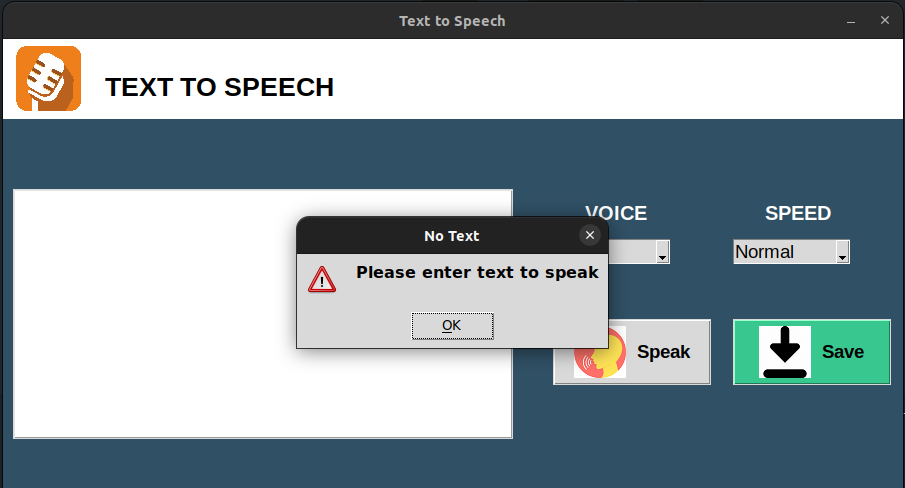
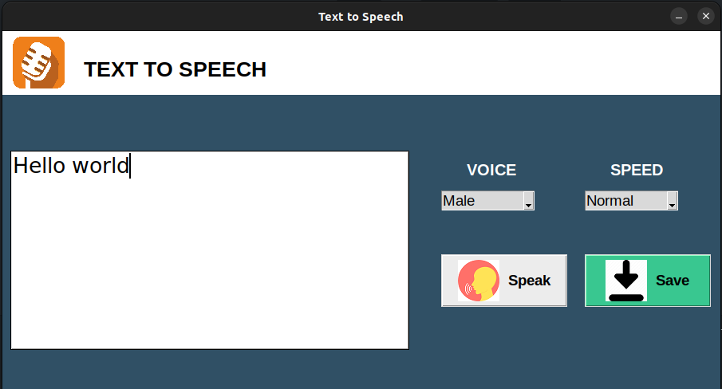
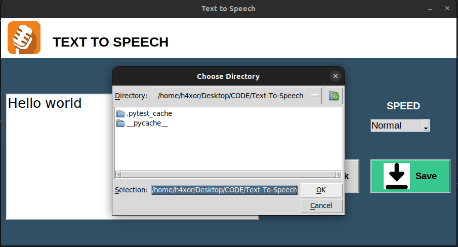
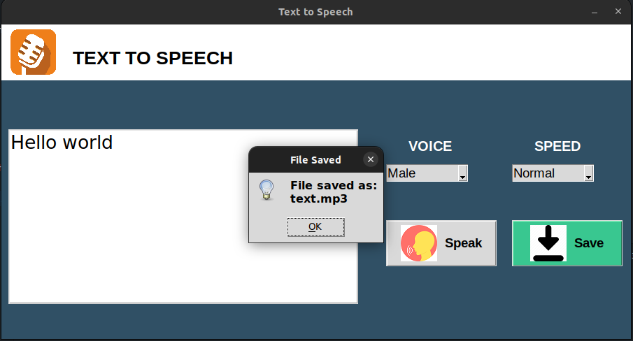
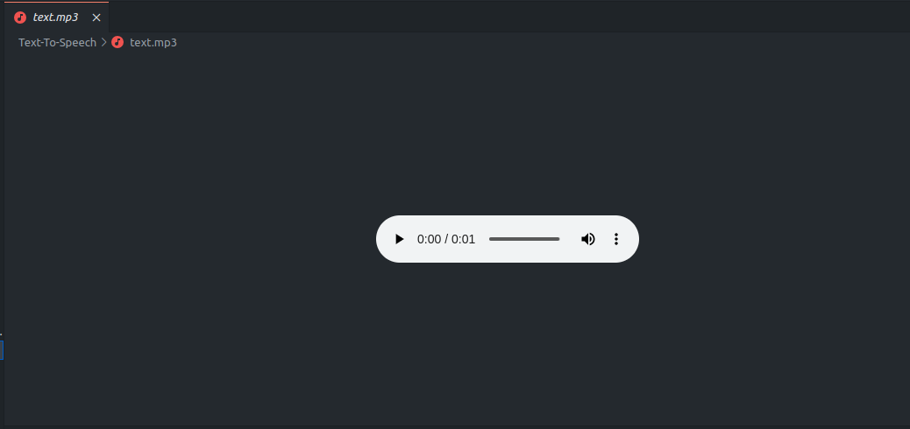

# 🗣️ Text-To-Speech GUI Application

A cross-platform, Python-based Text-to-Speech (TTS) application with a sleek graphical user interface built using Tkinter and `pyttsx3`. This application allows users to convert written text into spoken audio, with customization options for voice type and speech speed. The spoken content can also be saved as an `.mp3` file.

---

## 🎯 Features

- 🎤 **Instant Speech Playback**: Convert text to speech with one click.
- 📁 **Save as MP3**: Save the speech audio as a `.mp3` file in any desired folder.
- 🧠 **Cross-platform Support**: Works on both Windows (with SAPI5 support) and Linux.
- 🧩 **Voice Customization**: Choose between available male and female voices (where supported).
- 🚀 **Speed Control**: Select speech speed - Fast, Normal, or Slow.
- 🔔 **Robust Error Handling**: Alerts users for empty inputs or failed operations.
- 🧑‍💻 **User-friendly Interface**: Simple, responsive, and intuitive layout with icons.

---

## 🖼️ GUI Screenshots

| Screenshot | Description |
|-----------|-------------|
|  | 🏠 **Main Screen**: Home interface of the app |
|  | ⚠️ **Error Handling**: Prompts if no text is entered |
|  | ✍️ **Text Box**: Area where the input text is entered |
|  | 💾 **Save Dialog**: Choose where to save the audio |
|  | ✅ **Save Confirmation**: File successfully saved |
|  | 📁 **TTS File**: Example of a saved `text.mp3` |

---

## 🚀 How to Use

### 📥 Clone the Repository

```bash
git clone https://github.com/waziri245/Text-To-Speech.git

cd Text-To-Speech
```

### 🔧 Install Requirements

Make sure you have Python 3.7+ installed.

```bash
pip install -r requirements.txt
```

### ▶️ Run the Application

```bash
python -m src.text_to_speech
```

---

## 📁 Project Structure

```
Text-To-Speech/
├── .github/
│   └── workflows/
│       └── python-tests.yml
├── assets/
│   ├── icons/
│   │   ├── download.png
│   │   ├── mic.png
│   │   └── speak.png
│   └── screenshots/
│       ├── main_screen.png
│       ├── error_handling.png
│       ├── text_box.png
│       ├── save_file.png
│       ├── saved_file.png
│       └── tts_mp3.png
├── src/
│   ├── __init__.py
│   └── text_to_speech.py
├── tests/
│   ├── __init__.py
│   └── test_tts.py
├── .gitignore
├── LICENSE
├── README.md
├── requirements.txt
└── setup.py
```

---

## 🛡️ Error Handling

- ⚠️ If no text is entered when clicking **Speak** or **Save**, the user is alerted with a warning.
- ❌ Errors during speech synthesis or file saving are caught and displayed.
- 🧠 Auto-generates a unique filename if a file with the same name already exists in the destination folder.

---

## 📝 License

This project is licensed under the MIT License.  
See the [LICENSE](LICENSE) file for more info.

---

## 🧑‍💻 Author

Developed by  **Atal Abdullah Waziri**  
🎓 Co-founder of [Stellar Organization](https://stellarorganization.mystrikingly.com/).

---
